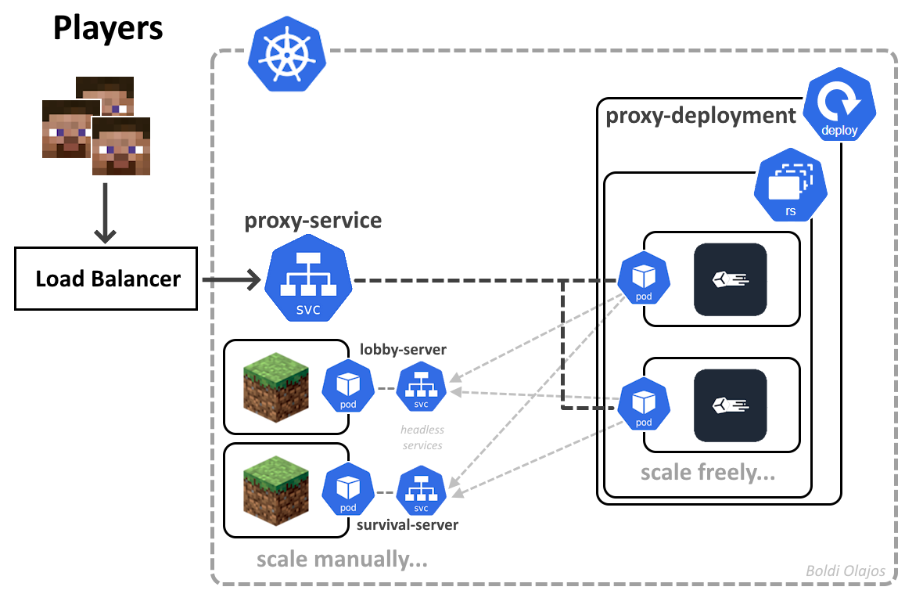

# Infra 3 - Project T4 [Boldizsár Olajos]

## Introduction
This document aims to provide a comprehensive overview of the project,  
as well as explain the design choices made. The requirements can be found [here](https://docs.google.com/document/d/1iHbbnzF8yV0_AoWtJk3uStr7HuQtaM4TLDj6L7C1xYc).  

_This document should be considered as the "PDF", since there is no Canvas submission._

> In quote blocks like this one, additional notes and background information are included that are not strictly necessary to understand the system.
### Application Components
For this project I decided to build a **_minecraft server network_**/cluster, this consists of two components:
- two or more minecraft servers (the game servers)
- one or more proxy servers
#### What is the game server?
The game server is exactly what you would imagine, this is what enables multiplayer for minecraft. Players can connect to a server to play together.

Today the most modern game server available is [Paper](https://papermc.io/software/paper), which is an active [open source](https://github.com/PaperMC/Paper) community project, under the **PaperMC** organization. This is what we will be using.

> It is noteworthy, that Paper is based on an older community game server named [Spigot](https://www.spigotmc.org/wiki/about-spigot/), 
> which in turn is a continuation of the CraftBukkit/Bukkit project now also maintained by them. 
> All of these game servers **modify the official "vanilla" minecraft servers** [provided by Mojang](https://www.minecraft.net/en-us/download/server). 
> This shows the **rich history** and the amount of **development** that has been done by the community. The main benefit of the unofficial servers are the ability to customize them by both extended configuration options and plugins.
#### What is the proxy server?
Minecraft proxy servers are a **community invention**, it was needed because some of the community servers have grown so large a single game server was no longer able to support enough players, and also because there was a need to run **multiple servers with different configurations**. This meant **players would have to disconnect to switch** between different game modes, for example, to go from the `survival.example.com` server to the `minigames.example.com` server. 

The basic idea behind proxy servers is that **they pretend to be game servers**, but then connect to a **backend game server** and pass the packets between the client and backend server.
The power of the proxy server is that **it allows players to switch between multiple backend servers**, while their client thinks they are connected to a single game server (the proxy), this means:
- Players do not need to disconnect to switch between backend servers
- Backend servers can have completely different configurations
- Multiple backend servers can be set up with the same configuration to spread out players between them, for example players can decide to play on survival1, survival2 or survival3, they can even play on multiple of these servers acting as "different saves"

We will use the [Velocity](https://papermc.io/software/velocity) proxy, which is also developed by the same **PaperMC** organization. Unlike Paper, Velocity is not built on the previous community proxy, [BungeeCord](https://www.spigotmc.org/wiki/bungeecord/), but is instead a **complete rewrite from scratch**. While Velocity supports the old BungeeCord protocol as "legacy", this is **not recommended** because that protocol is **insecure**, instead we will be using Velocity's own "modern" protocol.
#### Protocols & Security
The minecraft game servers use the official [minecraft protocol](https://wiki.vg/Protocol) to communicate with clients (Players), this protocol is under the control of Mojang (the developers of Minecraft).
##### How the Minecraft Protocol is secured
The protocol uses [encryption](https://www.wiki.vg/Protocol_Encryption), but (until [very recently](https://www.minecraft.net/en-us/article/minecraft-snapshot-24w03a)) only for servers in _**online mode**_.

**Online mode** refers to a setting found in all minecraft servers' configurations in the `server.properties` file:
```properties
online-mode=true
```

This setting is **enabled by default**, this option determines if a server will contact Mojang's authentication servers to authenticate a player that is trying to connect to the server, this is very important for enabling encryption but also for **server security**, because if this authentication step does not happen the client can tell the server any Minecraft Username and the server will just accept it, this includes the username of any **server operator** who has admin privileges on the game server, no need to say, that is indeed a bad thing.

The only **legitimate reason**, to disable online mode is to start a server without access to the internet, such as for a LAN party, or as we will later see **to setup a proxy server**.

> Of course, there is a more common, illegitimate reason to do this as well, that being letting players with pirated copies of the game (often referred to as a cracked client) join the server, in that case another authentication method has to be set up to secure the server, such as a plugin that makes players log in or register with a password on the server.
##### Proxies and security
By the nature of how proxies work, they connect to the backend game servers **pretending to be the player** that is in reality connected to the proxy itself. For this reason, the backend servers must run with **online mode disabled**. To preserve security the proxy also has an **online mode** setting, we will **keep this enabled**, meaning now the proxy will do the authentication of the players by contacting the Mojang Authentication API itself.

> Older proxies, such as BungeeCord mentioned earlier, would stop here, 
> this is why **the bungeecord protocol is considered insecure**. 
> Since the backend servers are running in offline mode, anyone who can connect directly to a backend server **can bypass authentication on that server**. This is why it was very crucial for old proxies to be set up correctly, by placing the backend servers behind firewalls and only allowing connection from the proxies.

With **Velocity's modern protocol**, an additional security measure is taken, the proxy has what is called a `forwarding.secret` this is usually placed in a configuration file with the same name, the **backend servers** are then **also configured with this secret**, creating an encrypted secure connection that authenticates the proxy even if the backend server is exposed to the internet.

I have **used both security measures:** _a forwading secret_, and _only exposed the proxy server_, not the backend servers.
#### Diagram of the Velocity Proxy Architecture


## Deployment
The main deployment target is **kubernetes (on minikube)**, but **docker compose is also fully functional** and offers a much more convenient and fast way to test the images, at the cost of not being able to scale the proxy. Both deployment methods will expose the proxy server on the default minecraft port 25565 on the host, meaning minecraft will be able to just connect to "localhost" as the ip address.

**PLEASE NOTE:** running the two backend game servers and a proxy server will **require quite a bit of memory**, namely **at least 4,5 GB** with the current configuration, (1,5+2,5+0,5 GB for the lobby, survival and proxy respectively) **plus any additional overhead** from the deployment method used.

### Docker Compose
Using docker compose can be a quick way to test the images, to do this first make sure **you have ran the build script at least once**:
```sh
./build.sh
```
Then simply use docker compose **in the project root**:
```sh
docker compose up -d
```
_You may wish to remove the -d option above, to easily see the logs of the servers, this would show information about players connecting and switching between servers or even just "pinging" the proxy from their server list._

This will start a simple configuration, where the **proxy server is exposed on port 25565**, while the backend game servers are only exposed within the docker network enabling the proxy server to connect to them.
#### Cleanup
You can easily remove the resources afterward, if you wish to keep the save data of the servers, such as world and player information simply remove the -v option to keep the relevant volumes for later:
```sh
docker compose down -v
```
### Kubernetes (minikube)
This is the main deployment target, the deploy script will call the build script for you, so there is no need to run anything else, simply start the deploy script:
```sh
./deploy-minikube.sh
```
_**Please Note:** docker, kubectl and minikube are all required, you must also run in the project root._

You will also need to have the **minikube load balancer** running to properly expose the service:
```sh
minikube tunnel
```
#### Design Choices

##### Scaling
As you can see on the diagram above, scaling via kubernetes is only possible for the proxy servers, the backend game servers must be manually scaled by changing the configuration. I will explain here the multiple reasons why this is the case.

While the proxy servers have no persistent data, the backend game servers will almost certainly need to persist data such as the game saves/worlds. Because these game servers are **stateful** we cannot simply auto-balance between multiple instances, each server instance **could have unique data**, therefore the **players do care which server they are on**! This means the proxy has to know the exact instances it is to connect to, there cannot be an intermediate layer, which is only possible using static configuration files!

Proxy servers on the other hand are **not stateful**, their temporary data only needs to persist as long as each connection itself. This means they can be easily scaled, for this purpose I have placed them in their own deployment where the replica set can be easily scaled. In addition the service that exposes these replicas uses the ***LoadBalancer*** type, which will use the implementation specific load balancer to automatically spread out players between the different proxy instances.

> As the diagram also indicates, the **Load Balancer** is not a part of the kubernetes cluster, it is implementation dependent, in **minikube** this is started by running the `minikube tunnel` command.
###### How manual scaling works
If, let's say, we have too many players that wish to play the survival gamemode at the same time, we would have to configure and create a new instance based on the same configuration, but it will still operate on a different save, so we would configure these two survival instances as two separate servers for the proxy e.g. survival1 and survival2 in the proxy config, then the players can decide which survival instance they wish to play on. This effectively doubles the maximum players that can play survival, but doesn't change the number of players that can play on a single world at the same time.
#### Cleanup
You can remove the resources by running the following command:
```sh
kubectl delete -f kubernetes.yml
```

## Requirements

| Minimum criteria                                                | Rating    |     | Explanation                               |
| --------------------------------------------------------------- | --------- | --- | ----------------------------------------- |
| 2+ application(s)(components) in at least 2 separate containers | 8 points  | ✅   | velocity & paper                          |
| Automated deployment with bash scripts.                         | 2 points  | ✅   | ./deploy-minikube.sh                      |
| Extra points can be obtained with:                              |           |     |                                           |
| With secure communication, e.g. https                           | +1 point  | ✅   | [[readme#Proxies and security]]           |
| Using own container registry                                    | +1 point  | ✅   | ./build.sh pushes to local registry       |
| Use dedicated network local<br><br>(implicit when using k8s)    | +1 point  | ✅   | Both k8s and dc create dedicated network. |
| Using local volume or cloud storage (buckets)                   | +1 point  | WIP | dc uses volumes for save data, k8s wip    |
| With one of following 3 deployment options                      |           |     |                                           |
| - Well working in Docker Compose                                | +1 point  | ✅   | [[readme#Docker Compose]]                 |
| - Serverless with Cloud Run                                     | +3 points | -   |                                           |
| - Well working in Kubernetes                                    | +4 point  | ✅   | [[readme#Kubernetes (minikube)]]          |
| Extra challenge through research                                |           |     |                                           |
| Use of Terraform for automated deployments                      | +2 points | -   |                                           |
